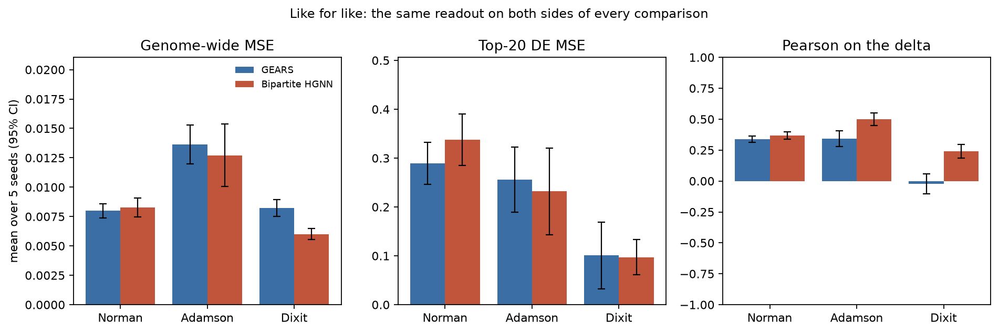
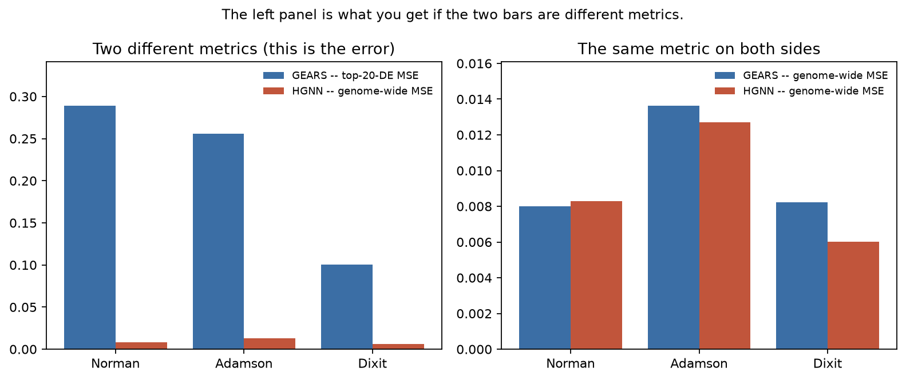
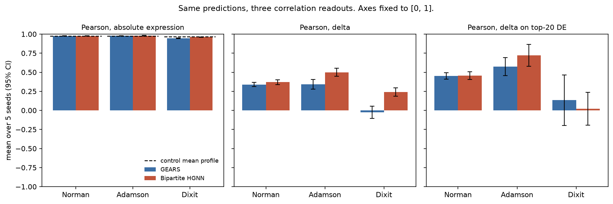
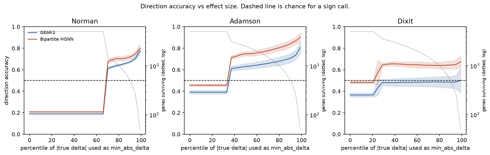
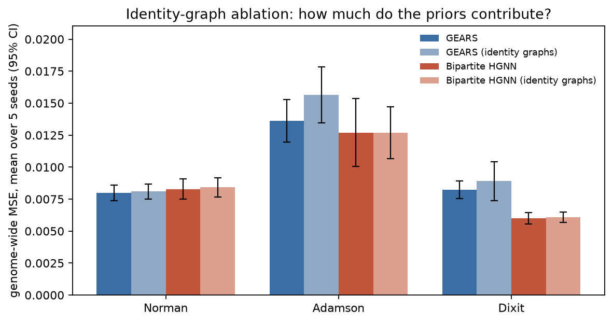

# perturbation-readouts

Reproducing GEARS on three public CRISPR perturbation datasets, and measuring how much of the
reported improvement is the choice of readout.

---

## Attribution

> The original project, "Beyond GEARS", BMI 212, March 2026, was joint work with **Ally Seba** and
> **Blake Masters**. This repository is an independent reproduction and readout analysis by me
> ; the code here is new. It depends on GEARS (Roohani, Huang & Leskovec, *Nature Biotechnology*
> 2024) as an installed package rather than a fork, and on the three datasets' original authors for
> the data.

---

## What this is

Three public CRISPR perturbation datasets. Two models — GEARS itself, and a bidirectional bipartite
heterogeneous GNN over perturbation and gene nodes. Both trained by the same loop, on the same
splits, under the same loss, with five seeds each. Every readout this literature reports computed
from **identical saved predictions**, in one module, so they can be compared.

The thesis is not that anyone's work is wrong. It is that **the choice of evaluation metric
determines the conclusion**, and that this is demonstrable on public data with public models.

The three questions the repository answers, in order:

1. **Do the two models actually differ?** Scored the same way on the same predictions, with CIs.
2. **How large is the gap between two commonly reported MSEs?** Genome-wide against top-20-DE,
   measured for each model separately, so it can be seen to be a property of the metric pair.
3. **Why is direction accuracy below chance?** Swept against effect size, with the answer reported
   whichever way it comes out.

---

## The metric problem

The source project's deck reported the bipartite HGNN beating GEARS by 17x, 27x and 76x on Norman,
Adamson and Dixit. Beside that, GEARS' own training logs from the same project printed:

| | Norman | Adamson | Dixit |
|---|---|---|---|
| GEARS **genome-wide** validation MSE (logs) | 0.0034 | 0.0062 | 0.0014 |
| GEARS **top-20-DE** MSE (logs, test) | 0.1680 | 0.2515 | 0.0699 |
| "GEARS (Baseline)" on the slide | 0.0775 | 0.1877 | 0.1212 |
| "Bipartite HGNN" on the slide | 0.0045 | 0.0070 | 0.0016 |

The slide's GEARS column sits in the top-20-DE range. The HGNN column sits in the genome-wide range.

**This is an inference from magnitudes, not a verified fact** — the code behind that slide is not
available, and this repository makes no claim about what it did. What this repository does is make
the question checkable: compute both metrics for both models on the same predictions and the same
split, and print them side by side. Whatever the answer is, that table is the contribution.

Two related issues, both addressed below:

- **Pearson ~0.99 on absolute expression proves almost nothing.** Predicting the unperturbed mean
  profile for every condition — a model with no perturbation input at all — scores in the high 0.9s
  on these datasets. The informative quantity is Pearson on the *delta*. See Ahlmann-Eltze, Huber &
  Anders, *Nature Methods* 2025.
- **Direction accuracy of 7-20% is not "near chance"**; for a binary sign call it is far *below*
  chance. The likely mechanism is that the metric is scored over all ~5,000 genes, most of which have
  a true delta that is noise around zero. That is testable, and it is the most valuable experiment
  here — see `notebooks/04`.

---
## Results

Five seeds per cell, mean with a 95% t-interval. **Scale matters for reading these**: 32 cells per
condition, 6 epochs, 50 optimiser steps per epoch, on CPU. Both models get exactly the same budget,
so the comparison is fair; the absolute values are not comparable to published GPU-scale numbers.
See [Limitations](#limitations).

Every number below is generated by `pertreadout report` from `runs/*/predictions.npz`. None is typed
by hand.

<!-- BEGIN GENERATED: pertreadout report -->
### Like for like: genome-wide MSE (lower is better)

| Dataset | GEARS | Bipartite HGNN | Winner | Gap | CIs overlap? |
|---|---|---|---|---|---|
| Adamson | 0.01363 [0.01197, 0.01530] | 0.01271 [0.01005, 0.01537] | Bipartite HGNN | 7% | yes |
| Dixit | 0.00823 [0.00752, 0.00894] | 0.00601 [0.00557, 0.00646] | Bipartite HGNN | 37% | no |
| Norman | 0.00800 [0.00740, 0.00860] | 0.00828 [0.00749, 0.00907] | GEARS | 4% | yes |

### Like for like: top-20-DE MSE (lower is better)

| Dataset | GEARS | Bipartite HGNN | Winner | Gap | CIs overlap? |
|---|---|---|---|---|---|
| Adamson | 0.25598 [0.18975, 0.32221] | 0.23179 [0.14295, 0.32063] | Bipartite HGNN | 10% | yes |
| Dixit | 0.10077 [0.03285, 0.16868] | 0.09718 [0.06104, 0.13332] | Bipartite HGNN | 4% | yes |
| Norman | 0.28911 [0.24647, 0.33175] | 0.33781 [0.28521, 0.39042] | GEARS | 17% | yes |

### Like for like: Pearson on the delta (higher is better)

| Dataset | GEARS | Bipartite HGNN | Winner | CIs overlap? |
|---|---|---|---|---|
| Adamson | 0.34317 [0.27924, 0.40710] | 0.49998 [0.44788, 0.55207] | Bipartite HGNN | no |
| Dixit | -0.02433 [-0.10514, 0.05649] | 0.23933 [0.18485, 0.29381] | Bipartite HGNN | no |
| Norman | 0.33839 [0.31126, 0.36552] | 0.36968 [0.33962, 0.39974] | Bipartite HGNN | yes |

### The metric-pair ratio: top-20-DE MSE / genome-wide MSE

| Dataset | GEARS | Bipartite HGNN |
|---|---|---|
| Adamson | 18.5x [15.3, 22.4] | 17.7x [13.5, 23.1] |
| Dixit | 10.1x [4.0, 25.9] | 15.5x [10.4, 23.2] |
| Norman | 36.0x [31.2, 41.5] | 40.6x [36.2, 45.5] |

Measured band across datasets and models: **10x - 41x**.

### What the mismatched pairing produces

| Dataset | GEARS top-20-DE MSE | HGNN genome-wide MSE | Apparent ratio | Genome-wide, both sides | Top-20-DE, both sides |
|---|---|---|---|---|---|
| Adamson | 0.2560 | 0.0127 | **20.1x** | 1.07x | 1.10x |
| Dixit | 0.1008 | 0.0060 | **16.8x** | 1.37x | 1.04x |
| Norman | 0.2891 | 0.0083 | **34.9x** | 0.97x | 0.86x |

### Pearson: what the readout choice is worth

| Dataset | Model | Pearson absolute | Control mean profile | Pearson delta | Pearson DE delta |
|---|---|---|---|---|---|
| Adamson | GEARS | 0.9769 | 0.9752 | 0.3432 | 0.5735 |
| Adamson | Bipartite HGNN | 0.9789 | 0.9752 | 0.5000 | 0.7215 |
| Dixit | GEARS | 0.9462 | 0.9655 | -0.0243 | 0.1337 |
| Dixit | Bipartite HGNN | 0.9604 | 0.9655 | 0.2393 | 0.0220 |
| Norman | GEARS | 0.9764 | 0.9757 | 0.3384 | 0.4506 |
| Norman | Bipartite HGNN | 0.9761 | 0.9757 | 0.3697 | 0.4576 |

### Direction accuracy against effect size

| Dataset | Model | All genes | At the 99th percentile of \|true delta\| | Climbed? | Reaches chance? |
|---|---|---|---|---|---|
| Adamson | GEARS | 0.391 | 0.805 | yes | yes |
| Adamson | Bipartite HGNN | 0.456 | 0.902 | yes | yes |
| Dixit | GEARS | 0.365 | 0.501 | yes | yes |
| Dixit | Bipartite HGNN | 0.482 | 0.675 | yes | yes |
| Norman | GEARS | 0.189 | 0.774 | yes | yes |
| Norman | Bipartite HGNN | 0.208 | 0.798 | yes | yes |

| Dataset | True delta within 1.96 SE of zero | True delta exactly zero |
|---|---|---|
| Adamson | 91.4% | 35.8% |
| Dixit | 94.7% | 24.4% |
| Norman | 96.4% | 69.0% |

### Identity-graph ablation: what the priors are worth

| Dataset | Model | With GO + co-expression priors | With identity graphs | Change |
|---|---|---|---|---|
| Adamson | GEARS | 0.01363 | 0.01565 | +14.8% |
| Adamson | Bipartite HGNN | 0.01271 | 0.01269 | -0.1% |
| Dixit | GEARS | 0.00823 | 0.00890 | +8.1% |
| Dixit | Bipartite HGNN | 0.00601 | 0.00608 | +1.2% |
| Norman | GEARS | 0.00800 | 0.00809 | +1.2% |
| Norman | Bipartite HGNN | 0.00828 | 0.00842 | +1.6% |


<!-- END GENERATED -->

### Reading the tables

**On genome-wide MSE the two models are close.** The gap is 4% on Norman, 7% on Adamson and 37% on
Dixit, and on two of the three the confidence intervals overlap — meaning these runs do not establish
an ordering there at all. Only Dixit separates, and it separates in favour of the bipartite model.
The direction of the remaining differences is mixed: GEARS is ahead on Norman, behind on Adamson and
Dixit. Nothing here supports an order-of-magnitude claim in either direction.

**The metric-pair ratio is a property of the metric pair, not the model.** On each dataset, the
`top-20-DE / genome-wide` ratio is close to identical for the two models — 36.0x against 40.6x on
Norman, 18.5x against 17.7x on Adamson — despite their different architectures, different parameter
counts and different predictions. The measured band is **10x - 41x**, widening with the strength of
the differential-expression signal in the dataset.

That band is the whole mechanism. Pairing one model's top-20-DE MSE against another's genome-wide
MSE produces an apparent **17x - 35x** improvement (the mismatched-comparison table above) between
two models that are within 4-37% of each other when scored the same way. This is the one place in
this repository where a ratio of that size appears, and it appears with both metrics named on both
sides, as an illustration of what metric pairing produces.




*The left panel of the second figure is what you get if the two bars are different metrics.*

**Pearson on absolute expression is close to free.** The do-nothing predictor — the unperturbed
control mean profile, no perturbation input at all — scores 0.975 on Norman, 0.975 on Adamson and
0.966 on Dixit. The trained models score 0.976, 0.977-0.979 and 0.946-0.960. On Dixit *both models
score below the do-nothing baseline* on this readout while scoring positively on Pearson-delta, which
is exactly the failure mode the readout hides. Pearson on the delta separates the models cleanly;
Pearson on absolute expression does not separate anything.



**Direction accuracy: the sub-chance number is an artifact of scoring sign on noise.** On Norman the
metric reproduces the original observation — 0.189 for GEARS and 0.208 for the bipartite model with
all genes included, far below the 0.5 a coin flip would give. Restricting to genes whose true delta
is larger, it climbs monotonically to **0.774 and 0.798** at the 99th percentile. It climbed on all
three datasets and both models, without exception -- but how far it climbs depends on the dataset.
On Norman and Adamson every curve passes 0.5 comfortably (0.71-0.90 at the 99th percentile). On
Dixit, where the differential-expression signal is weakest, the bipartite model reaches 0.675 while
GEARS reaches 0.501 -- chance, not past it -- and GEARS' identity-graph variant peaks at 0.457 and
never reaches chance at all. The mechanism below is what the climb demonstrates; the height of the
climb is not uniform.

The explanation is the second table above. **91-96% of (condition, gene) true deltas are within 1.96
standard errors of zero**, and on Norman **69% are exactly zero** -- a gene with no detected
expression in either arm. Their sign is not a question with a right answer, and GEARS'
`frac_correct_direction_all` requires an exact `sign()` match, so a gene whose delta is exactly zero
can never be scored correct at all. Add any small systematic bias in the predicted delta and the
whole population moves one way.

That 69% is visible directly in the figure below: the Norman curves are flat until the 67th
percentile and then step, because every threshold below that point is zero and excludes nothing. The
step is where the exactly-zero genes drop out.

Two caveats on those percentages. They are inflated by this repository's 32-cells-per-condition
subsampling, which enlarges the standard error of every measured delta -- at full depth fewer genes
would be inside the noise floor. And the count uses `<=` rather than `<`, because a gene with a delta
of exactly zero also has a standard error of exactly zero, and excluding it from "indistinguishable
from no change" would be backwards.

The threshold grid is fixed on each run's own percentiles of `|true delta|` before any accuracy is
computed. It was not tuned to produce the curve.



**The identity-graph ablation.** Replacing the GO and co-expression graphs with identity graphs —
self-loops only, no prior information — costs GEARS 14.8% on Adamson, 8.1% on Dixit and 1.2% on
Norman in genome-wide MSE. For the bipartite model it costs between -0.1% and +1.6%, which is inside
the seed-to-seed noise. At this training budget the priors are worth something to GEARS on the two
single-gene screens and close to nothing anywhere else. That is consistent with the source project's
informal finding that the GO priors contributed less than the architecture assumed, but it is a
statement about *this* budget: undertrained models cannot exploit a prior they have not had time to
use, so this is a lower bound on the priors' value, not a measurement of it.



### What this does and does not show

It shows that on identical predictions and identical splits, the choice between two commonly reported
MSEs moves the number by 10x to 41x, and that pairing them across models manufactures a 17x-35x
"improvement" between models that are within 4-37% of each other. It shows that Pearson on absolute
expression is nearly saturated by a predictor with no perturbation input. It shows that a
direction-accuracy figure far below chance climbs steeply once genes without a measurable response
are excluded -- past chance on five of the six model-dataset pairs, and to chance on Dixit/GEARS,
where that signal is weakest.

It does not show which model is better. At this training budget, with these confidence intervals, the
two models are not separated on two of the three datasets.

---

## How it works

```
src/pertreadout/
├── data.py                    # download, normalise, subsample, split; checksum manifest
├── models/
│   ├── gears_baseline.py      # the pinned cell-gears package, unmodified
│   └── bipartite_hgnn.py      # pert <-> gene bipartite GNN, this repo's model
├── readouts.py                # every metric, in one place  <-- the core module
├── train.py                   # one training loop, used by both models
├── evaluate.py                # tables from saved predictions
├── figures.py                 # figures from tables; honest-axis rule enforced in code
└── cli.py
```

A run does not save a score. It saves `predictions.npz`: the condition-mean predicted and true
profiles on the held-out perturbations, the control mean profile, the per-condition top-20 DE gene
indices, and the standard error of each measured delta. Everything downstream is computed from those
files by `readouts.readout_table`. **Nothing computes a metric inline** — that is what makes the two
models comparable and what makes the numbers below checkable.

### Reproducing

```bash
git clone https://github.com/jackfenn/perturbation-readouts
cd perturbation-readouts
pip install -e ".[full,dev]"

python -m pertreadout.cli download          # ~3.5 GB into ~/.cache/pertreadout
python -m pertreadout.cli verify            # against data/checksums.json
python -m pertreadout.cli reproduce --config configs/norman.yaml
```

`reproduce` runs every seed for both models plus the identity-graph ablation, writes the predictions,
computes every readout from them, and renders the figures. It is resumable: a run whose
`predictions.npz` exists is skipped. `pertreadout report` regenerates the results section of this
README, so no number here is transcribed by hand.

Nothing over 10 MB is tracked, and no `.h5ad`, `.pt` or `.pkl` is tracked. CI fails the build if one
appears.

---

## Limitations

Read these before quoting any number above.

- **Scale.** These runs are CPU-bound on an 8-core laptop: 32 cells per condition, 6 epochs, and a
  cap of 50 optimiser steps per epoch. GEARS' published setting is 20 epochs over all cells. The
  learning-rate schedule is GEARS' own `StepLR(gamma=0.5)`, so this is a truncation of that schedule
  rather than a different one — but it is a truncation, and both models are undertrained relative to
  a GPU run. The budget is identical for both models, so the *comparison* is fair; the absolute
  numbers are not comparable to published ones. Every table carries the setting.
- **Subsampled cells per condition.** 32, chosen for runtime. Condition means are therefore noisier
  than they would be with all cells, which widens every CI and inflates the noise floor in
  `notebooks/04`.
- **One architecture family.** GEARS and a bipartite variant that shares its decoder and its loss.
  Nothing here says anything about other model families, and in particular nothing here tests the
  linear baselines of Ahlmann-Eltze et al., which are the more pointed comparison.
- **Unseen-*combination* generalisation is tested on Norman only.** Adamson and Dixit are single-gene
  screens; on those the held-out set is unseen single perturbations.
- **Dixit is small.** 19 perturbations, so roughly five held-out conditions per seed. Its CIs are wide
  and should be read as such.
- **No wet-lab validation.** Nothing here was tested at the bench.
- **The threshold analysis is descriptive.** `notebooks/04` characterises what direction accuracy does
  on this data. It is not a correction of the measurement model, and the threshold is never tuned to
  produce a nicer curve — the grid is fixed on each run's own percentiles before any accuracy is
  computed.

---

## What is deliberately not written here

Any sentence of the form "our model improves on GEARS by N times". If the honest result is that
GEARS wins, the table above says so. A repository reporting its own model losing, with the reason,
is a stronger signal than one reporting a large win — because the first is checkable and the second
invites the question that ends the conversation.

The one place a large ratio appears is the mismatched-comparison table, where it appears as an
illustration of what metric pairing produces, with both metrics named on both sides.

---

## Citations

- Roohani, Y., Huang, K. & Leskovec, J. Predicting transcriptional outcomes of novel multigene
  perturbations with GEARS. *Nature Biotechnology* **42**, 927-935 (2024).
  doi:10.1038/s41587-023-01905-6
- Norman, T. M. *et al.* Exploring genetic interaction manifolds constructed from rich single-cell
  phenotypes. *Science* **365**, 786-793 (2019). doi:10.1126/science.aax4438
- Adamson, B. *et al.* A multiplexed single-cell CRISPR screening platform enables systematic
  dissection of the unfolded protein response. *Cell* **167**, 1867-1882 (2016).
  doi:10.1016/j.cell.2016.11.048
- Dixit, A. *et al.* Perturb-Seq: dissecting molecular circuits with scalable single-cell RNA
  profiling of pooled genetic screens. *Cell* **167**, 1853-1866 (2016).
  doi:10.1016/j.cell.2016.11.038
- Ahlmann-Eltze, C., Huber, W. & Anders, S. Deep-learning-based gene perturbation effect prediction
  does not yet outperform simple linear baselines. *Nature Methods* (2025).
  doi:10.1038/s41592-025-02772-6

## License

MIT. GEARS is MIT-licensed and is depended on, not vendored; see `patches/README.md`.
